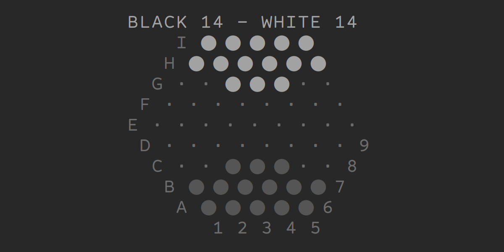

<!--
Copyright 2020 Scriptim (https://github.com/Scriptim)

Permission is hereby granted, free of charge, to any person obtaining a copy of this software and associated documentation files (the "Software"), to deal in the Software without restriction, including without limitation the rights to use, copy, modify, merge, publish, distribute, sublicense, and/or sell copies of the Software, and to permit persons to whom the Software is furnished to do so, subject to the following conditions:

The above copyright notice and this permission notice shall be included in all copies or substantial portions of the Software.

THE SOFTWARE IS PROVIDED "AS IS", WITHOUT WARRANTY OF ANY KIND, EXPRESS OR IMPLIED, INCLUDING BUT NOT LIMITED TO THE WARRANTIES OF MERCHANTABILITY, FITNESS FOR A PARTICULAR PURPOSE AND NONINFRINGEMENT. IN NO EVENT SHALL THE AUTHORS OR COPYRIGHT HOLDERS BE LIABLE FOR ANY CLAIM, DAMAGES OR OTHER LIABILITY, WHETHER IN AN ACTION OF CONTRACT, TORT OR OTHERWISE, ARISING FROM, OUT OF OR IN CONNECTION WITH THE SOFTWARE OR THE USE OR OTHER DEALINGS IN THE SOFTWARE.
-->

# Abalone BoAI [![GitHub Stars][shields_stars]][github_stargazers] [![GitHub Forks][shields_forks]][github_forks]

[![License][shields_license]](./LICENSE.md)
![Pipenv locked Python version][shields_python]
![Codecov][codecov]

This is a Python implementation of the board game [Abalone][wikipedia].

It is primarily intended to be played by artificial intelligence, but also offers the option to play as a human player.



## Command Line Usage

A minimal command line interface for running a game is provided by [`abalone/run_game.py`](./abalone/run_game.py). From the [`abalone`](./abalone) directory run:

    $ ./run_game.py <black player> <white player>

Replace `<black player>` and `<white player>` each with an artificial intelligence (or human player if you want to play yourself).

For instance, play against an AI that makes random moves:

    $ ./run_game.py human_player.HumanPlayer random_player.RandomPlayer

Loading your own AI works analogously with `<module>.<class>`.

## Abalone Rules

From [Wikipedia][wikipedia] ([CC BY-SA][wikipedia_license]):

> Abalone is an award-winning two-player abstract strategy board game designed by Michel Lalet and Laurent Lévi in 1987. Players are represented by opposing black and white marbles on a hexagonal board with the objective of pushing six of the opponent's marbles off the edge of the board.  
> The board consists of 61 circular spaces arranged in a hexagon, five on a side. Each player has 14 marbles that rest in the spaces and are initially arranged as shown below, on the left image. The players take turns with the black marbles moving first. For each move, a player moves a straight line of one, two or three marbles of one color one space in one of six directions. The move can be either broadside / arrow-like (parallel to the line of marbles) or in-line / in a line (serial in respect to the line of marbles), as illustrated below.

Initial position | Black opens with a broadside move | White counters with an in-line move
| --- | --- | ---
| ![Abalone Standard][wikimedia_abalone_standard] | ![Abalone Broadside][wikimedia_abalone_broadside] | ![Abalone Inline][wikimedia_abalone_inline]

> A player can push their opponent's marbles (a "sumito") that are in a line to their own with an in-line move only. They can only push if the pushing line has more marbles than the pushed line (three can push one or two; two can push one). Marbles must be pushed to an empty space (i.e. not blocked by a marble) or off the board. The winner is the first player to push six of the opponent's marbles off of the edge of the board.

## Write Your Own Artificial Intelligence

In order to write your own AI, create a python file with a class that inherits from [`abstract_player.AbstractPlayer`](./abalone/abstract_player.py) and implement the `turn` method:

```python
from abstract_player import AbstractPlayer

class MyPlayer(AbstractPlayer):
    def turn(self, game, moves_history):
        pass  # TODO: implement
```

Have a look at [`random_player.py`](./abalone/random_player.py) for a sample implementation.

Refer to the [`abstract_player.AbstractPlayer.turn`](./abalone/abstract_player.py) for details about the parameters and the return type.

A particularly useful method is [`game.generate_legal_moves()`](./abalone/game.py). It yields all legal moves that the AI can perform. The `turn` method can simply return one of the yielded values.

### A "move"

The return value of the `turn` method is called a *move*. This is a tuple, which consists firstly of the marbles to be moved and secondly of the direction of movement.  
The marbles are specified by the space where they are located on the board (see the image at the beginning of this document for the notation of the spaces). All spaces are listed in the [`Space`](./abalone/enums.py) enum. For an inline move only the trailing marble ("caboose") of the line to be moved is specified. For a broadside move only the two outermost marbles are given in a tuple.  
The second element of the tuple is the direction of movement. These are all listed in the [`Direction`](./abalone/enums.py) enum.
Therefore the two example moves from the images above (see *Abalone Rules*) would look like this:
```python
from enums import Direction, Space

# Black opens with a broadside move
# (returned from the turn method of the black player)
return (Space.C3, Space.C5), Direction.NORTH_WEST

# White counters with an in-line move
# (returned from the turn method of the white player)
return Space.I8, Direction.SOUTH_WEST
```

## Contribute

All contributions are welcome. See [`CONTRIBUTING.md`](./CONTRIBUTING.md) for details.

## See Also

- [Abalone Rulebook (PDF)][rulebook]

    [shields_stars]: https://img.shields.io/github/stars/Scriptim/Abalone-BoAI?style=social "GitHub Stars"
    [github_stargazers]: https://github.com/Scriptim/Abalone-BoAI/stargazers "GitHub Stargazers"
    [shields_forks]: https://img.shields.io/github/forks/Scriptim/Abalone-BoAI?style=social "GitHub Forks"
    [github_forks]: https://github.com/Scriptim/Abalone-BoAI/network/members "GitHub Forks"
    [shields_license]: https://img.shields.io/github/license/Scriptim/Abalone-BoAI?style=flat-square "License"
    [shields_python]: https://img.shields.io/github/pipenv/locked/python-version/Scriptim/Abalone-BoAI "Pipenv locked Python Version"
    [codecov]: https://codecov.io/gh/Scriptim/Abalone-BoAI/branch/master/graph/badge.svg "Code Coverage"
    [wikipedia]: https://en.wikipedia.org/wiki/Abalone_(board_game) "Wikipedia: Abalone (board game)"
    [wikipedia_license]: https://en.wikipedia.org/wiki/Wikipedia:Text_of_Creative_Commons_Attribution-ShareAlike_3.0_Unported_License "Text of Creative Commons Attribution-ShareAlike 3.0 Unported License"
    [wikimedia_abalone_standard]: https://upload.wikimedia.org/wikipedia/commons/5/57/Abalone_standard.svg "Abalone standard.svg"
    [wikimedia_abalone_broadside]: https://upload.wikimedia.org/wikipedia/commons/4/48/Abalone_broadside.svg "Abalone broadside.svg"
    [wikimedia_abalone_inline]: https://upload.wikimedia.org/wikipedia/commons/2/28/Abalone_inline.svg "Abalone inline.svg"
    [rulebook]: https://cdn.1j1ju.com/medias/c2/b0/3a-abalone-rulebook.pdf "Abalone Rulebook (PDF)"
